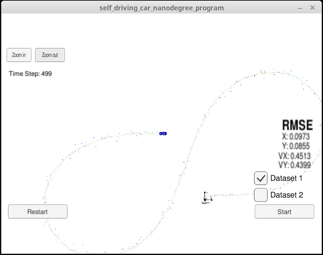

# Extended Kalman Filter 
Self-Driving Car Engineer Nanodegree Program

In this project I use a Kalman Filter to estimate the state of a moving object of interest with noisy lidar and redar measurements. To measure the accuracy of the positions and velocity predicted by the Kalman Filter, RMSE values between predictions and the ground truth included in the data is displayed. Final RMSE values are lower than the tolerance outlined in the [project rubric](https://review.udacity.com/#!/rubrics/748/view).

<figure>
	
	<figcaption>RMSE values for [x, y, vx, vy] < [0.11, 0.11, 0.52, 0.52]</figcaption>
</figure>

## Code description

A starter code is given by the Udacity project contained in `/src`. For the Kalman Filter to be fully implemented the following files where completed:

- `tools.cpp`: funtions to calculate root mean squared error (RMSE) and the Jacobian matrix
- `FusionEKF.cpp`: initializes the Kalman Filter on first data point, prepare the Q and F matrices, calls the prediction step, and depending on the data source calls the radar or lidar update functions
- `kalman_filter.cpp`: contains the Predict(), Update(), and UpdateEKF() functions

These three `.cpp` files provide functions for the classes defined in the corresponding `.h` files. Thus for using the functions defined in `tools.cpp` we need to instantiate the class Tools and access the methods Tools.CalculateRMSE() and Tools.CalculateJacobian(). In the same way, on the class declaration for FusionEKF, the object "KalmanFilter ekf_" is instantiated. This object contains the needed variables and matrices of the Kalman Filter that are used to calculate the position and velocity in its Predict(), Update(), and UpdateEKF() functions.

On the constructor function `FusionEKF::FusionEKF()` we initialize the Kalman Filter variables:
- x - state vector
- P - uncertainty covariance matrix
- F - state transition matrix
- Q - process noise
- H - measurement function
- R - measurement noise
	
From `main.cpp` the function `fusionEKF.ProcessMeasurement(meas_package);` is called for every new radar or lidar measurement. On the first call (flag "is_initialized_" is false) the state vector is initialized with the position extracted from the measurement data. The data source is taken into account, converting from polar coordinates in the case of radar measurement. The velocity is assumed zero, as there is still not enough data. The current timestamp is as well updated. After this initialization the function returns to `main.cpp`.

On subsequent calls we follow the Kalman loop of prediction and measurement update.

- Prediction: this step calculates what position and velocity is our object predicted to have, assuming constant velocity, and including our uncertainty about possible acceleration components into the process noise matrix Q. Before calling`ekf_.Predict()` the state transition matrix F and the process noise matrix Q are updated to take into account the time difference since the last measurement. Following the Kalman Filter equations the state is updated as:

		x = F * x
		P = F * P * F.transpose + Q
	
- Measurement update: if the data is coming from Lidar, the measurement function and the measurement noise previously defined are passed to the update step. The Kalman equations are:

		y = z - H * x					(Error)
		S = H * P * H.transpose + R		(Innovation covariance)
		K = P * H.transpose * S.inverse	(Kalman gain)
		//new estimate
		x = x + (K * y)
		P = (I - K * H) * P

If the data is coming from Radar, the measurement function is the Jacobian matrix that we calculate in `tools.cpp`. The radar measurement noise is previously defined as well. We pass these matrix to the update function for an Extended Kalman Filter `ekf_.UpdateEKF()`. The Extended Kalman Filter equations use the Jacobian Hj, and the h(x) funtion to calculate the error y:

		y = z - h(x)					(Error)
		S = Hj * P * Hj.transpose + R		(Innovation covariance)
		K = P * Hj.transpose * S.inverse	(Kalman gain)
		//new estimate
		x = x + (K * y)
		P = (I - K * H) * P

## Installation and Build

This project involves the Term 2 Simulator which can be downloaded [here](https://github.com/udacity/self-driving-car-sim/releases).

Once you clone this repo, it includes two files that can be used to set up and install [uWebSocketIO](https://github.com/uWebSockets/uWebSockets) for either Linux or Mac systems. For windows you can use either Docker, VMware, or even [Windows 10 Bash on Ubuntu](https://www.howtogeek.com/249966/how-to-install-and-use-the-linux-bash-shell-on-windows-10/) to install uWebSocketIO. 

Once the install for uWebSocketIO is complete, the main program can be built and run by doing the following from the project top directory.

- Make a build directory: `mkdir build && cd build`
- Compile: `cmake .. && make` 
   * On windows, you may need to run: `cmake .. -G "Unix Makefiles" && make`
- Run it: `./ExtendedKF `

Refer to the [Udacity project repository](https://github.com/udacity/CarND-Extended-Kalman-Filter-Project) for more detail intalation instructions.

## Other Important Dependencies

* cmake >= 3.5
  * All OSes: [click here for installation instructions](https://cmake.org/install/)
* make >= 4.1 (Linux, Mac), 3.81 (Windows)
  * Linux: make is installed by default on most Linux distros
  * Mac: [install Xcode command line tools to get make](https://developer.apple.com/xcode/features/)
  * Windows: [Click here for installation instructions](http://gnuwin32.sourceforge.net/packages/make.htm)
* gcc/g++ >= 5.4
  * Linux: gcc / g++ is installed by default on most Linux distros
  * Mac: same deal as make - [install Xcode command line tools](https://developer.apple.com/xcode/features/)
  * Windows: recommend using [MinGW](http://www.mingw.org/)

